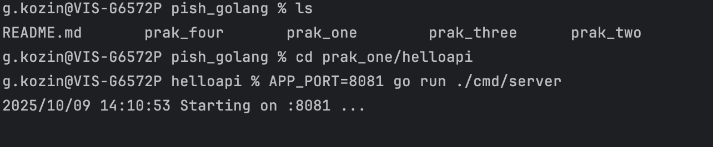
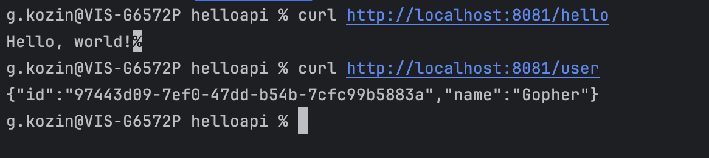

# Практическое задание №1: Установка и настройка окружения Go
`ФИО`: Козин Георгий Александрович

`Группа`: ПИМО-01-25

## Цель:
>🎯 Цель: развернуть рабочее окружение Go на Windows, создать минимальный HTTP‑сервис на net/http, подключить и 
> использовать внешнюю зависимость (UUID), собрать и проверить приложение.
---

> 💡 Important: В целях оптимизации рабочего пространства, было принято решение создать один репозиторий с дирикториями
> домашних работ.
---

## Задание:
* Установить Go и Git, проверить версии;
* Инициализировать модуль Go в новом проекте;
* Реализовать HTTP-сервер с маршрутами /hello (текст) и /user (JSON);
* Подключить внешнюю библиотеку (генерация UUID) и использовать её в /user;
* Запустить и проверить ответы curl/браузером.
* Собрать бинарник .exe и подготовить README и отчёт.

### Описание проекта и требования:
#### Структура проекта:
```
├── prak_one
│   ├── README.md
│   ├── helloapi
│   │   ├── cmd
│   │   │   └── server
│   │   │       └── main.go
│   │   ├── go.mod
│   │   ├── go.sum
│   │   ├── helloapi            # бинарник для macos
│   │   └── helloapi.exe        # бинарник для windows
│   └── images                  # изображения

```
#### Запуск проекта:
1) Клоним репозиторий:
```bash
git clone https://github.com/CyberGeo335/pish_golang.git
```
2) Проверяем что Go и Git есть:
```bash
g.kozin@VIS prak_one % go version
go version go1.23.2 darwin/arm64
g.kozin@VIS prak_one % git --version
git version 2.39.5 (Apple Git-154)
g.kozin@VIS prak_one % 
```
3) Переходим в первую домашнюю работу:
```bash
cd prak_one/helloapi
```
4) Так как последняя версия домашней работы сделана включительно до пункта 8, поэтому `APP_PORT` настраиваемвый:
```bash
# Для MacOS:

APP_PORT=8081 go run ./cmd/server

# Для Windows:

$env:APP_PORT="8081"
go run ./cmd/server
```
#### Проверка работоспособности:
1) Просмотрим версии:


2) Запустим:



Увидим, что всё отработало успешно, запускали на порту 8081

3) Проверим, что наши ручки работают:
```bash
curl http://localhost:8081/hello
curl http://localhost:8081/user
```


Ручки отработали, ответ получен. Так же была сделана проверка на форматирование кода:

